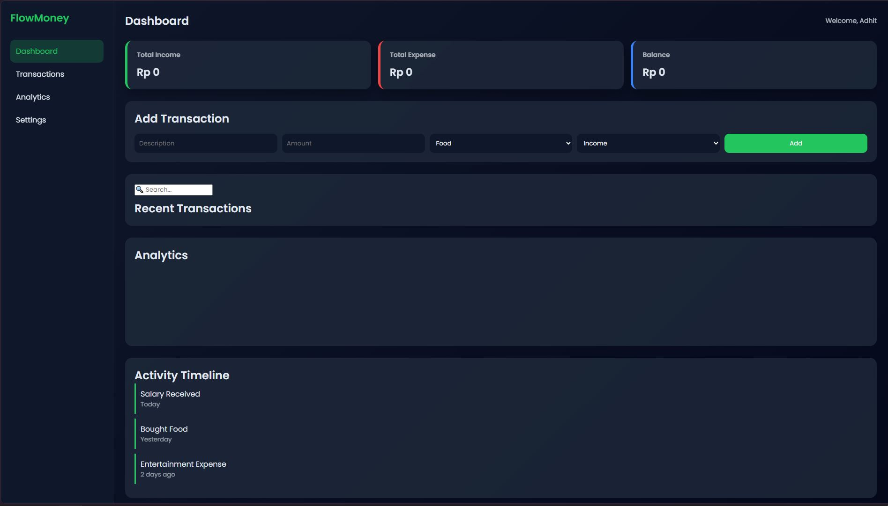

# FlowMoney - Smart Finance Tracker

> Track your money. Control your life.

**Live Demo:** https://agusadhitama.github.io/flowmoney/

---

## 📌 Overview

**FlowMoney** adalah web app sederhana namun powerful untuk membantu kamu mencatat, mengelola, dan menganalisis keuangan harian.
Dibuat dengan fokus pada **UI modern, interaktif, dan user-friendly experience**.

Project ini cocok sebagai :

* Personal finance tracker
* Portfolio project untuk bidang IT
* Base project untuk dikembangkan ke level lebih advanced

---

## ✨ Features

* Input pemasukan & pengeluaran
* Kategori transaksi
* Real-time balance calculation
* Interactive chart (Income vs Expense)
* Search & filter transaksi
* Auto save (localStorage)
* Smart notifications & insights
* Random financial quotes
* Detail transaksi (modal popup)
* Modern UI (dark mode + glass effect)

---

## 🛠️ Tech Stack

* **HTML**
* **CSS**
* **JavaScript**
* **Chart.js**

---

## 📸 Preview



---

## 🚀 Getting Started

Clone repository:

```
git clone https://github.com/agusadhitama/flowmoney.git
```

Open di browser:

```
index.html
```

---

## 🔮 Future Improvements

* Authentication system
* Cloud database integration (Firebase)
* Advanced analytics (per kategori)
* Export laporan ke PDF
* Full-stack version (API + database)

---

## 👨‍💻 Author

**Agus Satria Adhitama**

* 🌐 GitHub : https://github.com/agusadhitama
* 💼 LinkedIn : https://www.linkedin.com/in/agusadhitama

---

## ⭐ Support

Kalau kamu suka project ini :
- 👉🏾 kasih ⭐ di repo ini
- 👉🏾 share ke teman / LinkedIn

---

## 📄 License

This project is open-source and available under the MIT License.

---

🔥 *Built with passion, logic, and creativity.*
